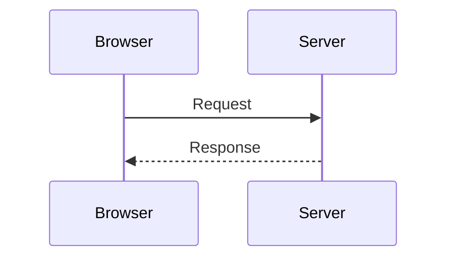
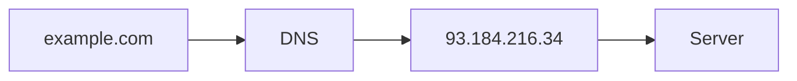
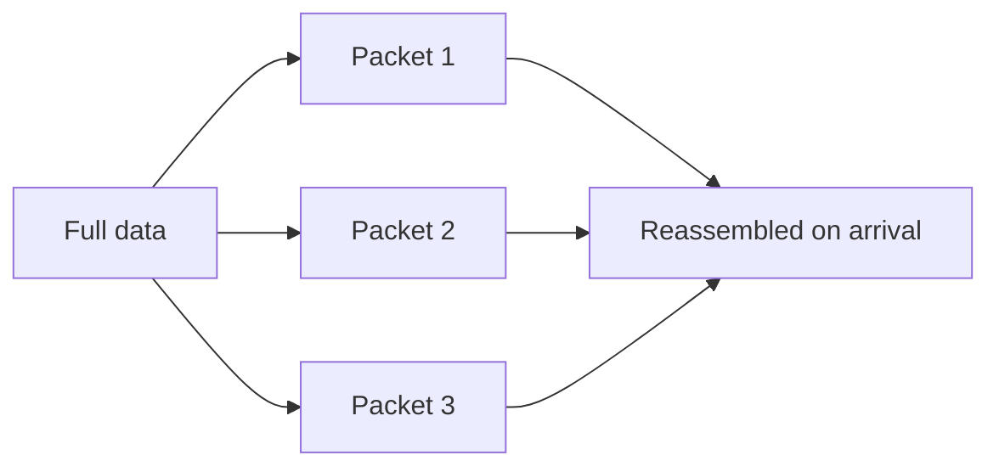
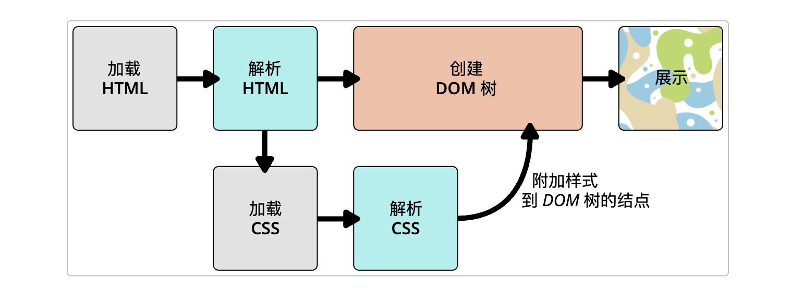

# How a Web Page Loads

The browser is the client. The machine that hosts the site is the server. The browser sends a request, and the server sends back a response.



## What one visit passes through

| Concept | Role | Analogy |
| --- | --- | --- |
| Network connection | Lets data travel across the web | The road to a shop |
| TCP/IP | Rules for how data is carried | Walking, cycling, or driving |
| DNS | Turns a domain name into an IP address | The shop's address book |
| HTTP | Rules for how the browser and server talk | The words used to place an order |
| Site files | The code and assets that make up a page | The goods in the shop |

Site files come in two kinds:

- **Code**: HTML, CSS, and JavaScript
- **Assets**: images, audio, video, PDFs, and similar files

HTML points to CSS with `<link>` and to JavaScript with `<script>`.

## DNS

DNS is a lookup table from domain names to IP addresses. After the browser sees `example.com`, it finds the server's IP, then sends the HTTP request there.



## Packets

Data on the internet is split into small packets before it is sent. Small packets are easier to forward, and they can take another route when one path is blocked.



## How the browser paints the page



The browser loads the HTML and parses it into a DOM tree. At the same time it loads the CSS, then attaches the parsed styles to the matching nodes.

Each tag becomes a DOM node. Nodes are linked: some are parents, and some are children.

```text
P
├─ "Let's use:"
├─ SPAN
│  └─ "HTML"
├─ SPAN
│  └─ "CSS"
└─ SPAN
   └─ "JavaScript"
```

1. Parse every stylesheet on the page, both styles written in the HTML and files loaded with `<link>`. Match each rule to the DOM nodes it applies to. That styled structure is the render tree.
2. Lay out the render tree: decide the size and position of each node, including images and other embedded media.
3. Paint the laid-out nodes onto the screen.

## JavaScript

After CSS is handled, the browser parses, interprets, compiles, and runs any JavaScript on the page, whether it is written in the HTML or loaded from an external file. This happens before the final paint, because script can change what gets drawn, for example by adding DOM nodes or editing existing ones.

This script reverses the text inside every `span`:

```js
const spans = document.querySelectorAll("span");
spans.forEach((span) => {
  const reversedText = span.textContent.split("").reverse().join("");
  span.textContent = reversedText;
});
```

## The browser as a runtime

Frontend code runs on a machine you do not control. You cannot know the user's operating system, browser, language, location, network, CPU, GPU, or memory.
