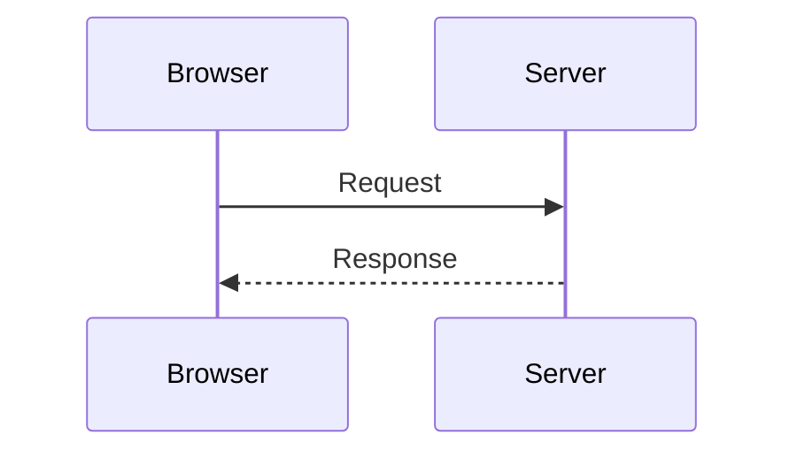
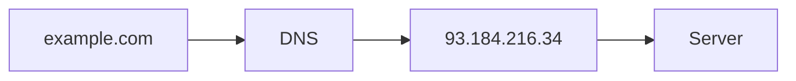
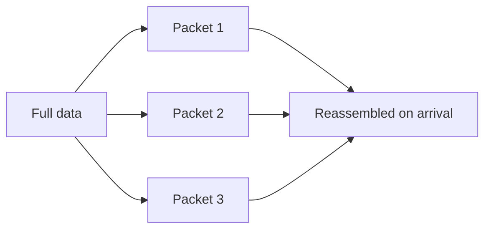

# How a Web Page Loads

The browser is the client. The machine that hosts the site is the server. The browser sends a request, and the server returns a response.



## What one visit passes through

| Concept | Role | Analogy |
| --- | --- | --- |
| Network connection | Carries data across the web | The road to a shop |
| TCP/IP | Rules for moving that data | Walking, cycling, or driving |
| DNS | Turns a domain name into an IP address | The shop's address book |
| HTTP | Rules for the browser–server conversation | The words used to place an order |
| Site files | Code and assets that make the page | The goods in the shop |

- **Code**: HTML, CSS, and JavaScript. HTML points to CSS with `<link>` and to JavaScript with `<script>`.
- **Assets**: images, audio, video, PDFs, and similar files.

## DNS

DNS maps a name such as `example.com` to an IP address. The browser looks up that IP, then sends the HTTP request there.



## Packets

Data is split into small packets before it is sent. Packets are easier to forward, and they can take another route when one path is blocked.



## How the browser paints the page


The browser parses HTML into a DOM tree and, at the same time, loads and parses CSS. Each tag becomes a node. A node can be a parent or a child.

```text
P
├─ "Let's use:"
├─ SPAN
│  └─ "HTML"
├─ SPAN
│  └─ "CSS"
└─ SPAN
   └─ "JavaScript"
```

1. Match every CSS rule to the DOM nodes it applies to. That styled structure is the render tree.
2. Lay out the render tree: size and position each node, including images and other media.
3. Paint the laid-out nodes onto the screen.

## JavaScript

Before the final paint, the browser parses, compiles, and runs JavaScript from the HTML or from an external file. Script can change the DOM, so it can change what gets drawn.

This example reverses the text inside every `span`:

```js
const spans = document.querySelectorAll("span");
spans.forEach((span) => {
  const reversedText = span.textContent.split("").reverse().join("");
  span.textContent = reversedText;
});
```

## The browser as a runtime

Frontend code runs on a machine you do not control. You cannot know the user's operating system, browser, language, location, network, CPU, GPU, or memory.
