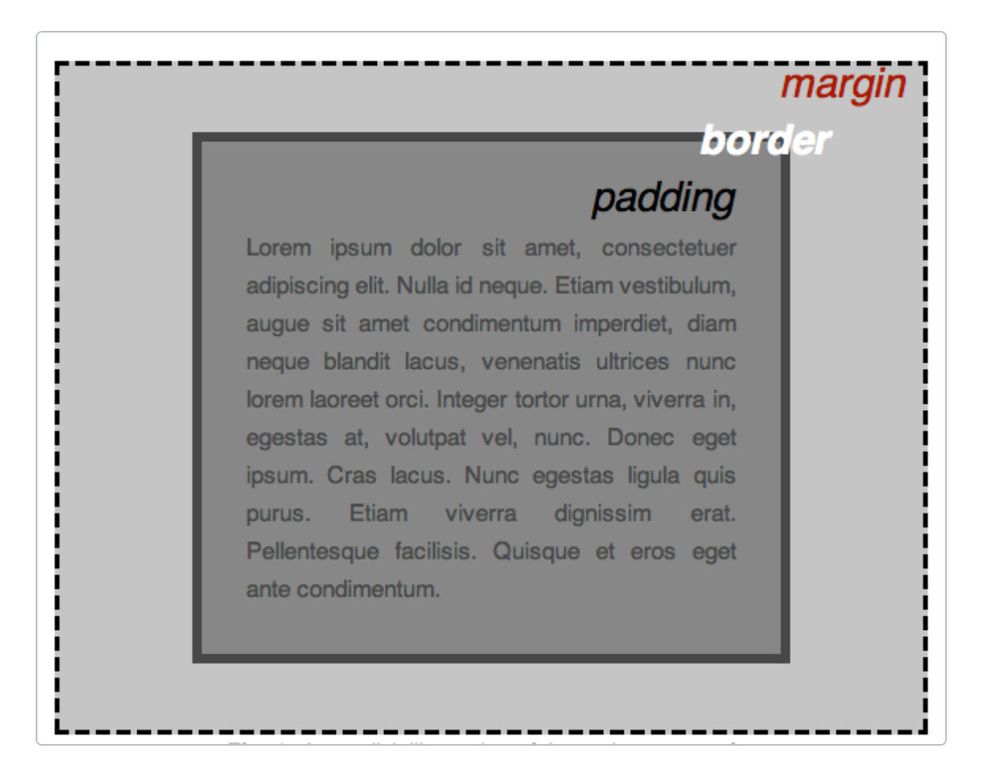

# CSS Basics

CSS describes how HTML should look.

## Rules

A rule targets elements and sets their style:

```css
h1 {
  color: blue;
  font-size: 60px;
}
```

| Part | Example | Role |
| --- | --- | --- |
| Selector | `h1` | Which elements the rule applies to |
| Declaration | `color: blue;` | One style instruction |
| Property | `color` | What to change |
| Value | `blue` | The setting for that property |

## Inheritance

`html` is the root of the page. Inherited properties set on it, such as `font-size` and `font-family`, pass down to the text inside.

## The box model

Every element is a box, from the inside out:

1. **Content** — the text or image
2. **Padding** — space inside the border
3. **Border** — the edge around the padding
4. **Margin** — space outside the border


